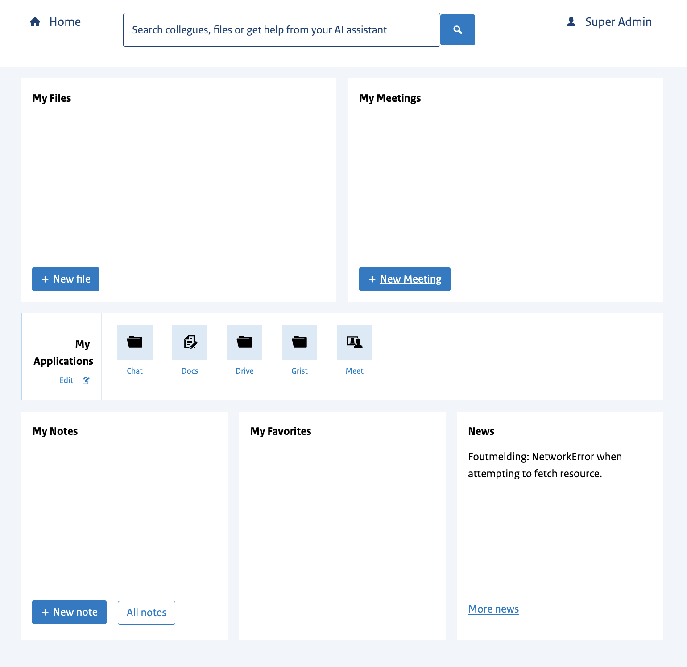
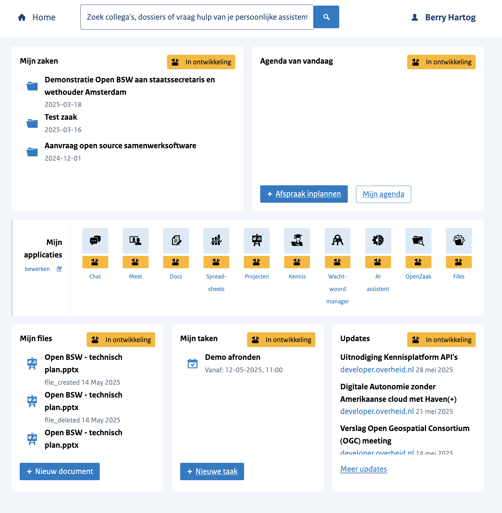

# 🏆 Final Submission for la-suite-portal

## Project
LaSuite portal

## Project Description
De LaSuite portal is the place where users can start their day. It combines all information from laSuite services and others into a manageable and organized dashboard.

For example it displays the most recently edited documents or notes. Recently shared files or next meetings. It can show your unread chat messages and integrated over standardized interfaces with services.

## Contributors
<a href="https://github.com/cocopops-fr">@cocopops-fr</a>, <a href="https://github.com/Corentin-BTS">@Corentin-BTS</a>, <a href="https://github.com/benbuckscg">@benbuckscg</a>, <a href="https://github.com/berrydenhartog">@berrydenhartog</a>

## Code base
https://github.com/berrydenhartog/lasuite-portal

## Deliverables 
[live demo](https://bureaublad.apps.digilab.network/)
```
username: baguette
password: thanksdinum&dgnum
```




## Key Achievements
Integrate Docs into the dashboard

## Challenges Overcome
Implement [token exchange](https://datatracker.ietf.org/doc/html/rfc8693) protocol to allow secure access to resources.

## Impact: A Seamless Start: A Story of Simplicity

Imagine starting your day without the usual scramble—no more hopping between tabs, digging through drive document, or opening a dozen different apps like grist, matrix chat and docs just to catch up.

With less time spent searching, there's more time for doing. It's not just about convenience; it's about unlocking focus, flow, and the freedom to get meaningful work done.

## Next Steps
* Add matrix, grist, meet integration. 
* Add portal customization per users
